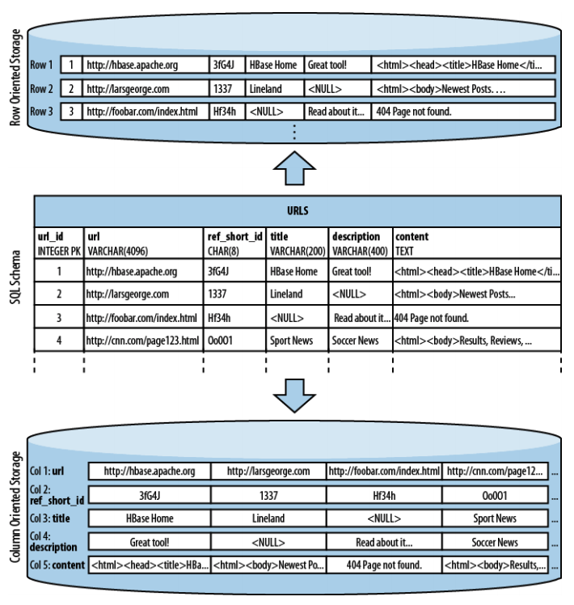

最近在看《Hbase The Definitive Guide, 2nd Edition》。Hbase 版本更新很快，第二版本相比第一版本更新了很多内容，而这一版还没有中文版。这本书第一章统领介绍了当前各类数据库的现状，读完收获颇多，所以我这里把第一章内容翻译出来。在第一版的基础上翻译的，英语好的还是推荐直接看英文原版。如有不对的地方，还请不吝指正。

<!-- more -->

## 第一章 简介

在探究 Hbase 的功能之前，我认为有必要先来思考一下为什么要设计出一套这样的存储框架。关系型数据库管理系统（Relational Database Management System，RDBMS）早在 20 世纪 70 年代已经出现了，并且已经帮助无数的公司和组织实现了给定问题的解决方案。时至今日，RDBMS 仍旧非常有用。很多情况下关系模型都能完美的阐述问题，但是在面对一些特殊场景时，关系模型并不是最佳的解决方案。1

### 海量数据的黎明

我们生活在一个互联网时代。我们所有人都通过互联网联系在一起。无论是想搜索最佳的火鸡菜谱，还是给妈妈买什么生日礼物，我们都希望能过互联网迅速找到答案，同时还希望结果有用，并且契合我们的需要。

因此，很多公司开始致力于提供更有针对性的信息，例如推荐或在线广告，并且提供针对性信息的能力直接影响了公司在商业上成败。现在，像 Hadoop2 这样的系统使公司能够储存和处理 PB 级的数据。并且，随着新的机器学习算法的发展等原因，收集更多数据的需求也在与日俱增。

以前，因为储存所有的信息并不划算，很多公司会忽略某些数据源，这在如今会让公司失去竞争力。储存并分析公司产生的所有数据点的需求不断增长。这直接反馈到公司的电子商务平台，并产生了更多的数据。

过去，唯一的选择就是将收集的数据裁剪后保存起来。例如，只保存最近 N 天的数据。这短期内是一个可行的方法，但却无法存储几个月或几年收集到的所有数据。因此建议：构建一个数学模型覆盖整个时间段，或者设一个算法，通过重跑之前所有的数据来改进它，使他运行的更好。

例如，Ralph Kimball 博士指出3：

> 数据资产会替代 20 世纪有形资产的地位， 成为资产负债表的重要组成部分。

他还指出：

> 数据的价值已经超越了传统企业广泛认同的价值边界。

Google 公司和 Amazon 公司是最早认识到数据价值的公司，他们已经开始开发满足自己业务的解决方案。例如，Google 公司在一系列技术出版物中介绍了一种基于商业硬件的可扩展的存储和处理系统。开源社区将 Google 公司的这些思想用到了开源 Hadoop 项目中：HDFS 和 MapReduce。

Hadoop 擅长存储任意的、半结构化数据，甚至是非结构化数据。因此它需要你在分析数据的时候决定如何解释这些数据，它允许你燧石修改数据分类方式：一旦更新了算法，只需要重新分析数据。

Hadoop 同样是当前所有数据库系统的一种补充。它给用户提供了一个无限的空间来让用户可在恰当的时间存储和获取数据，并且对大文件存储、批量访问和流式访问做了优化。这使得用户分析数据变得容易且迅速。但用户也需要通过随机访问而不是批量访问，这就好比在数据库中使用索引和全表扫描。

通常用户习惯于通过查询数据库来随机访问结构化数据。 RDBMS 是这方面最杰出的系统，但也有一些少量的变化和有差异的实现方式，比如对象存储数据库。大多数 RDBMS 遵守**科德十二定律（Codd's 12 rules）**4，这个定律对于 RDBMS 是刚性标准。这个底层结构经过仔细的研究，已经有相当长一段时间没有改变过了。 最近出现的不同的方法，如 **列式存储（column-oriented）**数据库和**大规模并行处理（Massively Parallel Processing，MPP）**，表明我们可以针对特定的工作负担重新思考技术， 但大多数解决方案仍遵从全部或者是部分科德十二定律，并没有打破常规。

> ### 列式存储数据库
>
> 列式存储数据库以列为单位存储数据，按列顺序存储在磁盘中。这种存储方式不同于传统数据库的行式存储，行式存储按行连续存储。图 1-1 形象的展示了两种存储方式在物理结构上的不同。
> 
> 列式存储的出现原因主要是基于以下假设：对于一个特定的查询，并不是所有的值都是需要的。这种情况很常见，因此需要选择一种更为合适的存储模式。
>
> 减少 I/O 是这个新式结构的主要优点，但它还带了一些额外的优点：因为一般来说同一列的数据通常是非常相似的，即使每行之间在逻辑上有些微小的差异。这相比行式存储多种多样的数据通常更适合压缩，因为大多数的压缩算法只关注有限的压缩窗口。
>
> 像增量压缩和前缀压缩这种专业算法，是基于列存储定制的，因而可以大幅度提高压缩比，从而降低带宽的消耗。

值得注意的是，从典型 RDBMS 的角度来看，HBase 并不是一个列式存储额数据库，但是他利用了磁盘上的列存储格式，这也是 RDBMS 与 HBase 最大的相似之处，因为 HBase 以列式存储的格式在磁盘上存储数据。但它与传统的列式数据库有很大不同：传统的列式数据库比较适合实时存取数据的场景，HBase 比较适合键值对的数据存取，或者有序的数据存取。

事实上，我会将 HBase 分到列族存储这一类，因为他将列分为不同的族，在每族中的数据是行式存储。之后会更详细讲解它的存储架构。

相比几年前，现如今数据产生的速度迅猛增长。并且随着全球化的发展，这种趋势更加猛烈。像 Google、Amazon、eBay 和 Facebook 这样的网站已经覆盖了地球上绝大多数人。全球化网络应用的概念已经形成，这种情况对于 HBase 非常合适。

举例来说，Facebook 每天向 Hadoop 集群中添加超过 15TB 的数据5，并对这些数据进行接下来的加工处理。这些数据的其中一个来源就是点击日志，当用户用户点击了它们的网站或点击了使用 Facebook 插件的网站，用户的每个行为都会记录下来。这非常适合批量处理，来训练机器学习模型用于预测和推荐系统。

Facebook 同时还有个实时组件，就是他们的消息系统，其中包括聊天、涂鸦墙和电子邮件。这个系统每月产生 1350 多亿条数据6。几个月之内就会产生一个量级庞大的尾部数据，这些数据需要被有效的处理。尽管其中大部分都存储到了二级系统7中，例如邮件中的附件，但这些信息产生的数据量仍旧十分巨大。如果像 Twitter 一样每条记录算 140 字节，每个月数据总量高达 17TB。到转移到 HBase 中之前，现存系统中已经包含了超过 25TB 的数据8。

另外在某些领域，少量面向 Web 服务的公司收集的数据在急剧增长，例如：

* 金融

    如股票涨跌的数据。

* 生物信息学

    如全球性生物多样性信息机构（Global Blodiversity Information Facility）（[http://www.gbif.org/](http://www.gbif.org/)）。

* 智能电网

    如OpenPDC（[http://openpdc.codeplex.com/](http://openpdc.codeplex.com/)）项目。

* 销售

    如销售终端（POS）产生的数据，或者是股票系统、库存系统。

* 基因组学

    如 Crossbow（[http://bowtie-bio.sourceforge.net/crossbow/index.shtml](http://bowtie-bio.sourceforge.net/crossbow/index.shtml)）项目。

* 移动电话服务、军事、环境工程

    它们也产生了大量的数据。

高效的更新和检索 PB 级并不容易，下面深入探讨一下其中面临的挑战。

**未完待续……**

## 注释

[1]. 例如，参见 Michael Stonebraker 和 Uğur Çetintemel 撰写的文章 “'One Size Fits All': An Idea Whose Time Has Has Come and Gone”。

[2]. 相关信息可在 [项目官网](http://hadoop.apache.org/) 中找到。也可以在 Tom White 编写的《hadoop: The Definitive Guide (Fourth Edition)》（O'Reilly 出版）找到你想了解的所有 Hadoop 知识。

[3]. 此处引用的是 Kimball 集团的 Ralph Kimball 博士的一篇为[“Rethinking EDW in the Era of Expansive Information Management” ](https://www.informatica.com/campaigns/rethink_edw_kimball.pdf)的演讲，这个演讲讨论了一个不断发展的企业数据库市场的需求。

[4]. Edgar F.Codd 定义了 13 条规则（编号从 0 到 12），这些规则促使**数据库管理系统（Database Management, DBMS）**成为 RDBMS。虽然 HBase 满足了大部分通用的规则，但仍有一些没有满足，例如其中最重要的规则 5：*一个关系数据库系统可以具有几种语言和多种终端访问方式，但必须有一种语言，它的语句可以表示为严格语法规定的字符串，并能全面的支持各种规则。*详情见维基百科上的 [科德十二定律](https://zh.wikipedia.org/zh-hans/科德十二定律)

[5]. 见 Facebook 提供的信息：[https://www.facebook.com/note.php?note_id=89508453919](https://www.facebook.com/note.php?note_id=89508453919)。

[6]. 见博文：[https://www.facebook.com/note.php?note_id=454991608919](https://www.facebook.com/note.php?note_id=454991608919)，来自 Facebook 的工程师团队。150 亿条墙数据和 1200 亿条条聊天记录，共计 1350 亿条数据。此外，还包含 SMS 和其他数据，总数据会更多。

[7]. Facebook 使用 [Haystack](http://project-haystack.org/) 来存储像照片一类的小文件，它通过将文件存储为二进制大对象来优化性能。

[8]. 见：[http://www.slideshare.net/brizzzdotcom/facebook-messages-hbase](http://www.slideshare.net/brizzzdotcom/facebook-messages-hbase)，这是 Facebook 的员工 Nicolas Spiegelberg 写的，他同时也是 HBase 的 committer。
